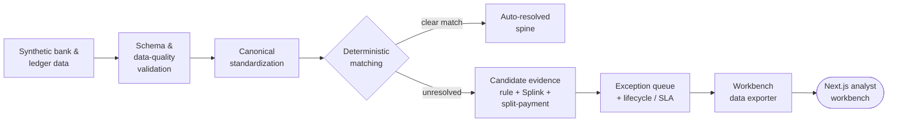

# Cash Reconciliation Automation

> A control-aware reconciliation workbench that automates clear matches, prioritizes exceptions, and helps analysts resolve cash breaks faster — while keeping a human accountable for every decision.

[](https://cash-reconciliation-automation.vercel.app)
[](#current-stage)
[](#how-v3-works)
[](#the-analyst-workbench)
[](#how-to-run-locally)

Cash reconciliation usually lives in fragile spreadsheets. This project shows how it can become a structured, auditable, analyst-facing workflow: a deterministic pipeline does the unambiguous matching, and an interactive workbench focuses human attention on the breaks that actually need judgment.

**The core principle:** the system *recommends*, the analyst *decides*, the action log *records*. Candidate evidence and model output are treated as hypotheses for review — never as final reconciliation decisions.

### ▶ Watch the 90-second demo

<video src="https://github.com/xiangtinghe616-blip/cash-reconciliation-automation/raw/main/frontend/design/demo/workbench-demo-short.mp4" poster="https://github.com/xiangtinghe616-blip/cash-reconciliation-automation/raw/main/frontend/design/demo/workbench-demo-poster.png" controls muted width="100%"></video>

**[▶ Try the live demo](https://cash-reconciliation-automation.vercel.app)** — no setup required.

## How it works



The reconciliation spine stays deterministic and auditable. Probabilistic and rule-based candidates are layered on top *only* to support analyst review of the leftover breaks.

A typical run funnels ~1,200 transactions down to a few hundred reviewable breaks:

| Stage | Count |
|---|---|
| Transactions in (bank + ledger) | ~1,195 |
| Auto-matched (deterministic rules) | ~400 |
| Candidate evidence generated | ~1,050 |
| Breaks routed to analyst review | ~340 |

(Counts vary per generated run; synthetic data is regenerated relative to the run date so SLA aging stays realistic.)

## The analyst workbench

The live demo is a **break-resolution workbench**, not a static dashboard. You can:

- Filter the priority queue by SLA pressure, priority, amount mismatch, or candidate availability
- Select a break and review bank-side vs. ledger-side evidence
- Use evidence triage to surface missing fields, differences, and matched evidence
- Open lifecycle, recommendation, and raw exception drill-downs
- Review candidate evidence as a *hypothesis*, then stage a Review / Accept / Reject decision
- Respect analyst-note requirements on higher-control actions
- Build a browser-local staged action trail and export it as JSON

The decision boundary is enforced in the UI: recommendations and candidates are clearly framed as support, and the analyst remains responsible for final disposition.

## How v3 works

1. Generate synthetic bank and ledger scenarios.
2. Convert records into canonical bank and ledger outputs.
3. Validate schema and data quality (custom + Frictionless-style + Great Expectations-style).
4. Apply deterministic reconciliation rules first.
5. Generate candidate evidence for unresolved or uncertain cases.
6. Build an exception queue and lifecycle / SLA context.
7. Export a workbench data package for the frontend.
8. Let the analyst review breaks, candidates, and staged actions in the workbench.

## What is already implemented

**Pipeline and data layer**

- synthetic v3 data generation with scenario manifest
- canonical bank and internal ledger outputs
- three-layer validation (custom, Frictionless-style, Great Expectations-style)
- deterministic reconciliation links
- rule-based candidate links, Splink-related candidate layer, split-payment candidates
- exception queue, lifecycle, and action recommendations
- pipeline run summary and frontend workbench data exporter

**Frontend workbench**

- priority queue with filters, search, and next-break navigation
- evidence triage and bank-vs-ledger field-level comparison
- drill-down panels and candidate evidence preview
- full candidate review with decision guardrails
- structured action-log preview, browser-local staged action trail
- localStorage persistence, JSON export, and clear controls

## Current stage

This is a **v3 alpha** built on synthetic data only. It is a product-facing demo of the workflow, not production software. The current version does not have:

- real bank / ERP connectors or real customer data
- authenticated analyst identity or permissioned workflow
- backend action submission API or server-side audit log
- production database, access control, or deployment hardening

Staged actions are saved only in the browser. They demonstrate the workflow but are not yet a real operational audit log.

## Repository structure

- `versions/v1/` — the first rule-based prototype
- `versions/v2/` — scenario-driven deterministic pipeline and synthetic data generation
- `versions/v3/` — the current contract-aware reconciliation pipeline
- `frontend/` — the Next.js break-resolution workbench
- `tests/` — pytest coverage for the v3 pipeline and exporter
- `frontend/design/` — design notes, release notes, QA checklists, action-log schema, and screenshots

## How to run locally

The fastest way to view the project is the hosted demo: https://cash-reconciliation-automation.vercel.app

To run the full stack locally:

```bash
# 1. Clone
git clone https://github.com/xiangtinghe616-blip/cash-reconciliation-automation.git
cd cash-reconciliation-automation

# 2. Python environment
python -m venv .venv
source .venv/bin/activate
python -m pip install --upgrade pip
pip install -r requirements-v3.txt

# 3. Run tests and generate v3 outputs
python -m pytest -q
python versions/v3/src/reconciliation/run_v3_pipeline.py
python versions/v3/src/publish/frontend_workbench_exporter.py

# 4. Run the Next.js workbench
cd frontend
npm install
npm run dev
# open http://localhost:3000
```

This runs the repository locally — it does not install a packaged product. Python generates synthetic reconciliation outputs, the exporter writes `frontend/public/demo-data/workbench-data.json`, Next.js serves the workbench, and staged actions live only in browser localStorage.

## Version history

- **v1** — first rule-based reconciliation prototype: basic matching and exception surfacing.
- **v2** — expanded synthetic data and a scenario-driven deterministic reconciliation pipeline.
- **v3 alpha** — validation contracts, canonical outputs, candidate evidence, exception lifecycle context, action recommendations, a frontend exporter, and an interactive Next.js workbench.

## Design principle

The boundary is deliberately simple:

> The system can **recommend**. The analyst **decides**. The action log **records**.

Candidate evidence is review support. It is never a final reconciliation decision.

## Safety note

This repository is for **synthetic data only**. Do not commit real bank statements, ERP extracts, customer names, account numbers, or operational reconciliation data. The public demo uses synthetic generated data.

## Next priorities

- continue Salt-inspired visual polish and queue throughput
- improve candidate evidence detail
- plan a backend action-log API and decide the persistence architecture
- record a concise alpha demo walkthrough
